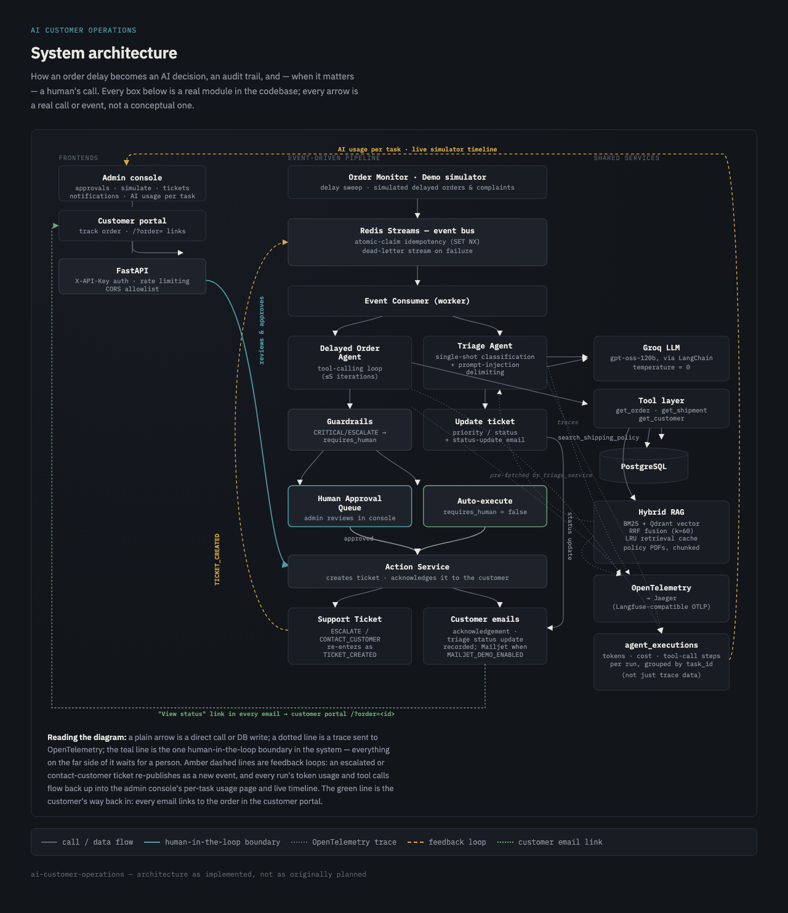
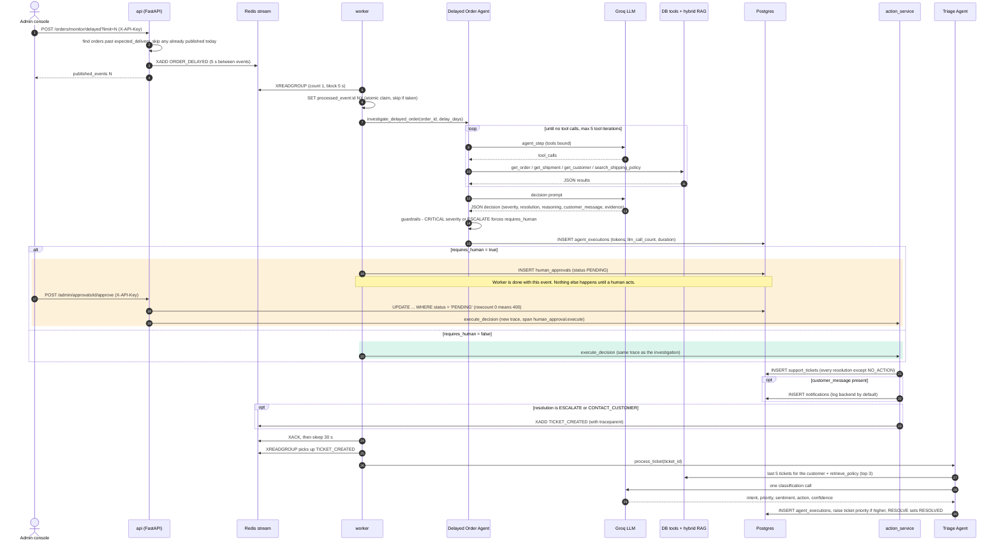
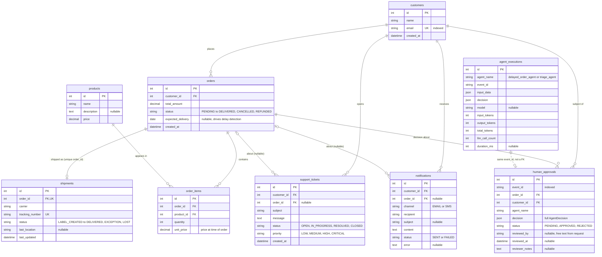
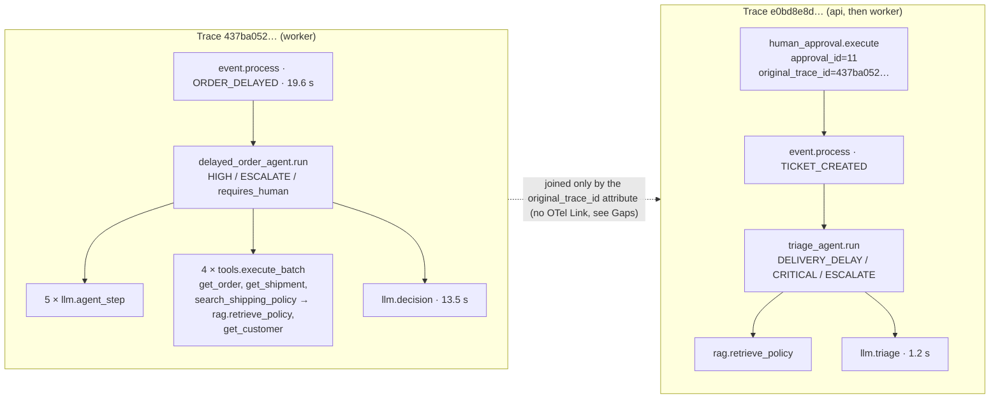

# Architecture

The [README](README.md) is the pitch and the setup guide. This document is
for going deeper: how an event actually moves through the system, what the
data model looks like, one real delayed order traced end to end, the API
boundary, and the reasoning (and known gaps) behind the main design choices.

- [System overview](#system-overview)
- [Event flow](#event-flow)
- [Data model](#data-model)
- [Worked example: one delayed order, end to end](#worked-example-one-delayed-order-end-to-end)
- [API surface](#api-surface)
- [Design rationale](#design-rationale)
- [Gaps found while writing this](#gaps-found-while-writing-this)

## System overview



Three processes do the work:

| Process | Code | Does |
|---|---|---|
| **api** (FastAPI) | `backend/app/main.py`, `backend/app/api/` | Serves the REST API. Delay detection and human approvals also *run* here, so an approved decision is executed in the API process, not the worker. |
| **worker** | `backend/app/workers/event_consumer.py` | Reads one event at a time from the Redis stream, runs the matching agent, then acks the event. |
| **frontends** | `frontend/admin`, `frontend/customer` | Static React builds served by nginx. They talk to the API from the browser. |

Postgres holds all business state. Redis has three jobs: the event stream
(`customer_operations_events`), the dead-letter stream
(`customer_operations_dead_letter`), and short-lived keys for idempotency,
rate limiting, and the worker heartbeat. Qdrant holds the policy-document
vectors, and Jaeger receives the traces.

## Event flow

This diagram follows an `ORDER_DELAYED` event from detection to triage. The
two coloured blocks are the branches the guardrail picks between. Note which
process runs `execute_decision` in each one: the **worker** on the
auto-execute path, the **API** (after a human clicks Approve) on the approval
path.



What the diagram leaves out:

- **Failure path.** If `process_event` raises, the worker retries up to 3
  times, 2 s apart. After the third failure it releases the claim, writes the
  event to the dead-letter stream, and acks the original. The worked example
  below hit this path for real on its first attempt.
- **Tickets that skip triage.** `TRACK_SHIPMENT` and `CONTACT_CARRIER` tickets
  are follow-ups for the operations team, so no `TICKET_CREATED` event is
  published for them. Only `ESCALATE` and `CONTACT_CUSTOMER` tickets reach
  the Triage Agent.
- **Rejection.** Rejecting an approval flips the row to `REJECTED` and logs
  it. Nothing is executed.
- **Pacing.** The worker sleeps 30 s after every event, whatever the outcome
  (see gotcha #3 in `CLAUDE.md`), so throughput is capped at about 2 events
  per minute.

## Data model

Built from the SQLAlchemy models in `backend/app/models/`. Only the columns
that matter for understanding the system are shown. `status`/`priority`
columns are plain `String(30)`/`String(20)`, not SQL enums, so values read
back from the database are bare strings (see `CLAUDE.md` gotcha #2).



Three things the diagram makes visible:

- **Decisions are stored as JSON snapshots, not relations.** `human_approvals.decision`
  holds the whole `AgentDecision`. On approval it's re-validated and executed
  exactly as the agent produced it. There is no link from an approval to the
  ticket it eventually creates.
- **`agent_executions` has no foreign keys at all.** It relates to everything
  else only through `event_id` (and, for triage, `input_data.ticket_id`),
  because it's an audit and usage log, not business state.
- **Tickets don't always need an order.** `support_tickets.order_id` is
  nullable, so a ticket can exist without one. Every ticket the agents create
  does have one.

## Worked example: one delayed order, end to end

Everything below is **captured output from a real run on 2026-09-22**, using
the default model (`openai/gpt-oss-120b` on Groq) against the seeded
database. It is not an illustrative sample. The model is nondeterministic, so
a re-run will pick different words and possibly a different decision. The
*shape* of the flow is what this section documents.

The approval was clicked by hand (`reviewer: docs-walkthrough`), which is why
this example goes through the human-approval branch.

### 0. A failed first attempt (the dead-letter path, for free)

The first attempt ran with `LLM_MODEL=llama-3.1-8b-instant`, which was then
the `config.py` default. Groq has since retired that model:

```text
Processing attempt 1/3: 8204a73e-2539-4f6a-bd6d-500a7df79ecb
Event processing failed (attempt 1): Error code: 404 - {'error': {'message': 'The model `llama-3.1-8b-instant` does not exist or you do not have access to it.', ...}}
Processing attempt 2/3: ...
Processing attempt 3/3: ...
```

After three attempts the event went to `customer_operations_dead_letter`, and
the default was changed to `openai/gpt-oss-120b`. Everything below is the
second, successful run.

### 1. The event

The admin console's "Publish N to event stream" with N = 1 calls
`POST /api/v1/orders/monitor/delayed?limit=1`, which wrote this to the Redis
stream:

```json
{
  "event_id": "be999cff-921c-4962-b0b4-d60479a15c40",
  "event_type": "ORDER_DELAYED",
  "occurred_at": "2026-09-22T09:34:09.827940Z",
  "source": "order-monitor",
  "data": {"order_id": 3, "customer_id": 2885, "expected_delivery": "2026-07-26", "delay_days": 58},
  "trace_context": {}
}
```

`trace_context` is empty because delay detection doesn't start a trace. The
worker's `event.process` span becomes the root.

### 2. The agent's investigation

The tool calls in the order the model chose them, from the Jaeger trace
(`437ba0526cec6070586807c3e829d8ad`):

| # | LLM step | Tool called | Result |
|---|---|---|---|
| 1 | `llm.agent_step` (690 ms, 455 tokens) | `get_order(3)` | found |
| 2 | `llm.agent_step` (766 ms, 535 tokens) | `get_shipment(3)` | found: USPS, `IN_TRANSIT`, last update 2026-09-13 |
| 3 | `llm.agent_step` (828 ms, 635 tokens) | `search_shipping_policy("delayed shipment policy 58 days")` | 5 chunks from `shipping_policy.pdf`, `refund_policy.pdf`, `return_policy.pdf` (`cache_hit=false`) |
| 4 | `llm.agent_step` (888 ms, 1,672 tokens) | `get_customer(2885)` | found |
| 5 | `llm.agent_step` (2,793 ms, 2,447 tokens) | none, so the graph moves on to the decision | |
| 6 | `llm.decision` (13,472 ms, 2,557 tokens) | none | JSON decision |

The decision call took 13.5 s because Groq's free tier answered `429` twice
and the Groq client backed off 6 s each time. That's the rate-limit pressure
the evaluation harness's pacing exists for.

### 3. The decision, after guardrails

Stored verbatim in `human_approvals.decision`:

```json
{
  "severity": "HIGH",
  "resolution": "ESCALATE",
  "reasoning": "Shipment is 58 days late, exceeds 7‑day threshold; policy requires escalated investigation and carrier contact.",
  "customer_message": "Dear Timothy,\n\nWe’re sorry that your order, originally expected on July 26, 2026, has not yet arrived. Our records show the shipment is still in transit with USPS, but there have been no recent tracking updates.\n\nWe have opened an escalated investigation with USPS and will keep you informed of any progress. If the carrier cannot locate the package within the next 48 hours, we will arrange a replacement shipment for you at no additional cost.\n\nThank you for your patience. Please let us know if you have any questions in the meantime.\n\nBest regards,\nThe Logistics Team",
  "requires_human": true,
  "evidence": [{"source": "shipping_policy.pdf", "page": 2, "chunk_index": 1}],
  "trace_id": "437ba0526cec6070586807c3e829d8ad",
  "trace_context": null
}
```

`resolution: ESCALATE` means the guardrail forces `requires_human: true`
whatever the model said. So the worker stored approval #11 as `PENDING` and
stopped.

Two details worth pausing on:

- **The drafted message makes an unapproved promise.** "We will arrange a
  replacement shipment ... at no additional cost" is a commitment the company
  hasn't signed off on. This is exactly the kind of message the approval step
  exists to catch.
- **`trace_context` is `null`.** See [Gaps](#gaps-found-while-writing-this).

The `agent_executions` row for the run:

| model | input_tokens | output_tokens | total_tokens | llm_call_count | duration_ms |
|---|---|---|---|---|---|
| `openai/gpt-oss-120b` | 6,668 | 1,633 | 8,301 | 6 | 19,533 |

8,301 is exactly the sum of the six `llm.total_tokens` span attributes
above. This is the per-call accumulation working as intended, rather than
recording only the last response's usage.

### 4. Approval → ticket → `TICKET_CREATED`

```text
POST /api/v1/admin/approvals/11/approve   {"reviewer": "docs-walkthrough", "notes": "..."}
→ 200 {"status":"approved","approval_id":11,"ticket_id":10}

POST /api/v1/admin/approvals/11/approve   (second click)
→ 400 {"detail":"Approval already APPROVED"}
```

The second request is the atomic claim at work: its `UPDATE ... WHERE status = 'PENDING'`
matched 0 rows. Executing the decision created ticket #10
(`ESCALATED: Delayed order (HIGH)`, priority `HIGH`) and notification #10.
The notification went to the seeded customer's address with status `SENT`,
but the default `log` backend only logs it and records the row; no email
went out. It also published:

```json
{
  "event_id": "6bd11e27-19e6-4712-9706-85cdb2b4e7e4",
  "event_type": "TICKET_CREATED",
  "source": "delayed_order_agent",
  "data": {"ticket_id": 10, "order_id": 3, "customer_id": 2885,
           "subject": "ESCALATED: Delayed order (HIGH)",
           "message": "Shipment is 58 days late, exceeds 7‑day threshold; policy requires escalated investigation and carrier contact.",
           "priority": "HIGH"},
  "trace_context": {"traceparent": "00-e0bd8e8d10ccaf81785b2d28cdf5807d-cf38e24cac2245ce-03"}
}
```

### 5. Triage

About 30 s later (the worker's post-event sleep), the worker picked up
`TICKET_CREATED` and ran the Triage Agent. It made one LLM call, taking
1.2 s and 1,440 tokens:

```json
{
  "intent": "DELIVERY_DELAY", "priority": "CRITICAL", "sentiment": "FRUSTRATED",
  "action": "ESCALATE", "confidence": 0.98, "requires_human": true,
  "reasoning": "Shipment is 58 days late, exceeding the 7‑day threshold which per policy requires human intervention and escalated investigation."
}
```

Triage ranked `CRITICAL` above the ticket's `HIGH`, so ticket #10 was raised
to **CRITICAL**. It stays `OPEN`: only `action: RESOLVE` without
`requires_human` auto-resolves a ticket, and nothing else acts on a triage
`ESCALATE`.

### 6. What Jaeger shows

Two traces, because the approval happened after the first one had closed:



The second trace shows cross-process propagation working. The span
`human_approval.execute` ran in the **api** container. `event.process` for
`TICKET_CREATED` ran in the **worker** container about 850 ms later and is
its *child* in the same trace, carried by the `traceparent` in the event
payload.

### Reproducing it

```bash
docker compose up -d && make seed   # skip make seed if already seeded (see README)
# Admin console → Delayed orders → Publish 1 to event stream, or:
curl -X POST -H "X-API-Key: $ADMIN_API_KEY" "localhost:8000/api/v1/orders/monitor/delayed?limit=1"
docker compose logs -f worker        # watch the tool loop
# Approvals panel → Approve (if the guardrail routed it there), then open the trace link in "AI usage"
```

## API surface

Everything is under `/api/v1`, except the two liveness checks. Parameters and
schemas live in the interactive docs at **http://localhost:8000/docs**. This
table covers only who can call what.

| Endpoint | Auth | Used by |
|---|---|---|
| `GET /health` (root, no prefix) | public | liveness check |
| `GET /api/v1/health/llm` | public | shows the configured model and whether a key is set (the key is never returned) |
| `GET /portal/orders/{id}?email=` | public, **rate-limited 20/min per IP** | customer portal order lookup |
| `GET /tickets?status=&customer_id=` | public | customer portal (a customer's tickets), admin console (ticket list) |
| `GET /orders/delayed` | public | admin console, "Delayed orders" panel |
| `GET /orders/{id}`, `GET /customers/{id}`, `GET /products/{id}` | public | no frontend uses these, they're plain reads |
| `POST /orders/monitor/delayed?limit=` | **X-API-Key**, rate-limited 5/min per IP | admin console "Publish N" |
| `POST /customers`, `POST /products`, `POST /orders`, `POST /shipments/{order_id}` | **X-API-Key** | scripts / manual use |
| `GET /admin/approvals/pending`, `POST /admin/approvals/{id}/approve`, `/reject` | **X-API-Key** (whole router) | admin console approvals |
| `GET /admin/notifications`, `GET /admin/usage` | **X-API-Key** | admin console |
| worker `GET :8001/health` | public (separate process) | Docker healthcheck + autoheal |

**Where the boundary actually sits:** writes and `/admin/*` need the key.
Every other read is public. The intended reason is the customer portal: a
guest who types in an order ID can't hold an API key, so the portal's lookup
has to be open. It gets a rate limit and an order-ID + email match (with a
single generic 404 either way, so it can't be used to enumerate valid order
IDs) instead.

The honest caveat is that the public reads are wider than the portal needs:

- `GET /tickets` with no filter returns **every** ticket with its customer's email.
- `GET /orders/delayed` returns every delayed order with the customer's email
  (about 1.3 MB against the seed data).

The admin console reads both of those without its key. Tightening this means
moving those two reads behind `require_api_key`, and giving the portal a
lookup that requires the email, like the order lookup does.

**Auth is one shared secret, not identity.** `reviewed_by` on an approval is
whatever string the console sends (it prompts for a reviewer name and keeps
it in localStorage). It's an audit label, not an authenticated user.

## Design rationale

The README's "Techniques and concepts" section covers the *what*. This
section covers the choices that are easy to get wrong.

**Four layers of event idempotency, each for a different duplicate.**
1. The detector writes a Redis key `delayed_order:{order_id}:{date}` (24 h
   TTL), so clicking "Publish" twice in one day doesn't enqueue the same
   order twice.
2. The consumer group gives each stream entry to one consumer.
3. `SET processed_event:{event_id} NX` stops a redelivered event (or a
   second worker racing the first) from being processed twice. It's checked
   *before* processing, not after.
4. On final failure the claim is *released* before the event is dead-lettered.
   That way a manual replay from the DLQ isn't silently skipped as "already
   processed".

**Guardrails after the model, not in the prompt.** The prompt asks the model
to set `requires_human`. `validate_decision()` then overrides it for
`CRITICAL`/`ESCALATE`. The prompt is the soft signal; the code is the
guarantee. In the worked example the guardrail and the model agreed, but the
model's opinion isn't what routed it.

**Approvals store the decision, not a reference to recompute it.** The
approver sees and approves the exact JSON the agent produced, including the
drafted customer message. Re-running the agent at approval time would
approve something the human never saw.

**Same-trace vs. linked-trace.**
- *Auto-execute path:* the follow-up event carries a `traceparent`, so triage
  continues the investigation's trace across the process boundary.
- *Approval path:* by design this should use an OTel **Link** back to the
  original trace, since that trace closed minutes or hours earlier. In
  practice it currently doesn't; see the next section.

**Hybrid retrieval with RRF.** BM25 and Qdrant results are fetched
(sequentially, top `2 × limit` each) and fused with Reciprocal Rank Fusion
(`Σ 1/(60 + rank)`). RRF uses only rank, not score, so there's no need to
make BM25 scores and cosine similarities comparable. Results are LRU-cached
(50 entries) in-process. The cache key is the query lowercased, trimmed, and
**truncated to 50 characters**, so two long queries that share a 50-character
prefix get the same cached result.

**Why the pacing looks excessive.** There's a 5 s gap between published
events, a 30 s sleep after each processed event, and backoff plus
checkpointing in the evaluation harness. All of it comes from the Groq free
tier. Even with the 30 s sleep, the worked example's decision call hit two
`429`s.

## Gaps found while writing this

These came up while verifying this document against the running system. They
are **not fixed**: development is paused, and each one is recorded here so the
docs describe what the code does rather than what it was meant to do.

- **The approval-path OTel Link is never created.** `approval_service.approve()`
  builds the Link from `decision.trace_context`. Nothing in production code
  ever sets that field (only tests do), so it's always `null` and
  `link_from_carrier()` returns `None`. The approval trace records only an
  `original_trace_id` attribute. You can still find the original trace by
  searching for that ID, but Jaeger won't render it as a link.
  Fix: set `decision.trace_context = inject_trace_context()` next to
  `trace_id` in `decision_node`.
- **Triage runs record zero token usage.** `triage_node` returns
  `llm_input_tokens`, etc., but `TriageState` doesn't declare those keys, so
  LangGraph drops them from the result. In the worked example, the triage
  span shows 1,440 tokens and the `agent_executions` row shows 0 tokens and
  0 LLM calls. The AI usage monitor therefore undercounts triage entirely.
- **The default model has no price.** `pricing.py` lists only Llama/Gemma
  models, so with `openai/gpt-oss-120b` the usage monitor reports
  `cost_incomplete: true` and a total cost of 0.
- **`make seed` isn't re-runnable once the agents have run.** It deletes
  orders but not the tickets, approvals, and notifications that reference
  them, so Postgres rejects it with a foreign-key violation. The rejected
  run makes no changes. To reseed from scratch, use
  `docker compose down -v`, which destroys *all* volumes.
- **`POST /shipments/{order_id}` sets `order.status = "Shipped"`.** That isn't
  a valid `OrderStatus` value (they're upper-case), and since the column is
  a plain string nothing rejects it.
- **Six tests fail even with network access.**
  - 4 in `tests/agents/test_delayed_order.py` call the real Groq API, but
    `conftest.py` injects a dummy `LLM_API_KEY`, so they get a 401.
  - `test_rag_integration.py` indexes the tool's result as a list of dicts,
    but the tool now returns a JSON string.
  - `test_warranty_policy_retrieval` gets empty results.
- **Stale reference.** `core/tracing.py`'s docstring points to
  `backend/docs/observability.md`, which doesn't exist.
