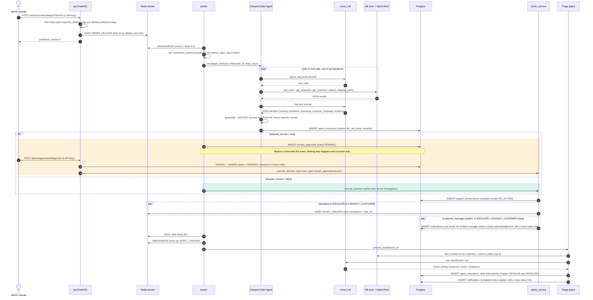
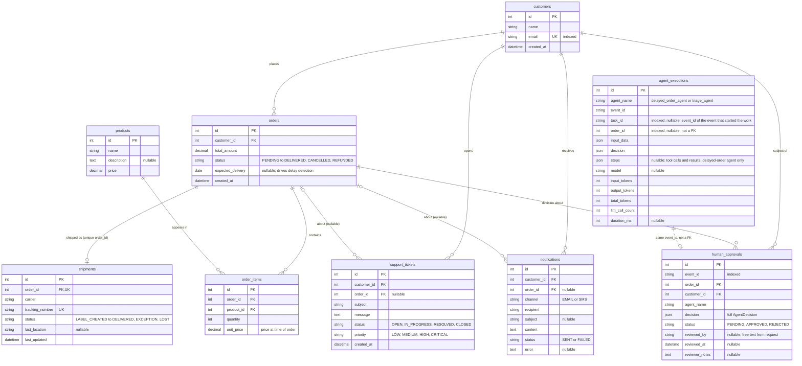
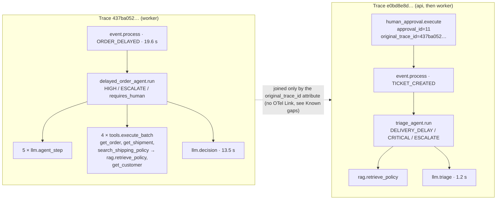

# Architecture

The [README](README.md) is the pitch and the setup guide. This document is
for going deeper: how an event actually moves through the system, what the
data model looks like, one real delayed order traced end to end, the API
boundary, and the reasoning (and known gaps) behind the main design choices.

- [System overview](#system-overview)
- [Event flow](#event-flow)
- [Data model](#data-model)
- [Customer emails](#customer-emails)
- [Demo simulator and timelines](#demo-simulator-and-timelines)
- [Worked example: one delayed order, end to end](#worked-example-one-delayed-order-end-to-end)
- [API surface](#api-surface)
- [Design rationale](#design-rationale)
- [Known gaps](#known-gaps)

## System overview


Three processes do the work:

| Process | Code | Does |
|---|---|---|
| **api** (FastAPI) | `backend/app/main.py`, `backend/app/api/` | Serves the REST API. Delay detection and human approvals also *run* here, so an approved decision is executed in the API process, not the worker. |
| **worker** | `backend/app/workers/event_consumer.py` | Reads one event at a time from the Redis stream, runs the matching agent, then acks the event. |
| **frontends** | `frontend/admin`, `frontend/customer` | Static React builds served by nginx. They talk to the API from the browser. The admin console is split into hash-routed pages (`#/simulate`, `#/tickets`, `#/notifications`, `#/usage`, Overview by default); each page polls only its own data. |

Postgres holds all business state. Redis has three jobs: the event stream
(`customer_operations_events`), the dead-letter stream
(`customer_operations_dead_letter`), and short-lived keys for idempotency,
rate limiting, and the worker heartbeat. Qdrant holds the policy-document
vectors, and Jaeger receives the traces.

## Event flow

This diagram follows an `ORDER_DELAYED` event from detection to triage. The
two coloured blocks are the branches the guardrail picks between. Note which
process runs `execute_decision` in each one: the **worker** on the
auto-execute path, the **API** (after a human clicks Approve) on the approval
path.



What the diagram leaves out:

- **Failure path.** If `process_event` raises, the worker retries up to 3
  times, 2 s apart. After the third failure it releases the claim, writes the
  event to the dead-letter stream, and acks the original. The worked example
  below hit this path for real on its first attempt.
- **Tickets that skip triage.** `TRACK_SHIPMENT` and `CONTACT_CARRIER` tickets
  are follow-ups for the operations team, so no `TICKET_CREATED` event is
  published for them. Only `ESCALATE` and `CONTACT_CUSTOMER` tickets reach
  the Triage Agent.
- **Rejection.** Rejecting an approval flips the row to `REJECTED` and logs
  it. Nothing is executed and the customer isn't emailed.
- **Customer-filed tickets.** A complaint filed through the simulator is
  acknowledged by email and publishes `TICKET_CREATED` directly, so it goes
  straight to triage with no delayed-order run in front of it. It's a task
  of its own (see `task_id` below).
- **Email delivery.** `INSERT notifications` always happens. A real email is
  sent only when `MAILJET_DEMO_ENABLED=true`; see [Customer emails](#customer-emails).
- **Pacing.** The worker sleeps 30 s after every event, whatever the outcome
  (see gotcha #3 in `CLAUDE.md`), so throughput is capped at about 2 events
  per minute.

## Data model

Built from the SQLAlchemy models in `backend/app/models/`. Only the columns
that matter for understanding the system are shown. `status`/`priority`
columns are plain `String(30)`/`String(20)`, not SQL enums, so values read
back from the database are bare strings (see `CLAUDE.md` gotcha #2).



Three things the diagram makes visible:

- **Decisions are stored as JSON snapshots, not relations.** `human_approvals.decision`
  holds the whole `AgentDecision`. On approval it's re-validated and executed
  exactly as the agent produced it. There is no link from an approval to the
  ticket it eventually creates.
- **`agent_executions` has no foreign keys at all.** It relates to everything
  else through plain indexed columns (`event_id`, `task_id`, `order_id`, and
  for triage `input_data.ticket_id`), because it's an audit and usage log, not
  business state. `order_id` lets the timeline find an order's runs with one
  indexed query; `task_id` groups a delayed-order run with the triage run on
  the ticket it created; `steps` records which tools the agent called and
  what came back (results truncated to 1,500 characters).
- **Tickets don't always need an order.** `support_tickets.order_id` is
  nullable, so a ticket can exist without one. Every ticket the agents or the
  simulator create does have one.

## Customer emails

Every customer email is built in `backend/app/services/customer_emails.py`
and goes through `notification_service.send_notification()`, which always
records a `notifications` row and, only when `MAILJET_DEMO_ENABLED=true`,
also sends it via Mailjet (plain-text and HTML parts).

| When | Email | Sent from |
|---|---|---|
| Delayed-order decision executed with a drafted `customer_message` | The agent's message. If an ESCALATE / CONTACT_CUSTOMER ticket was opened too, a line naming the ticket is appended, so it's one email, not two | `action_service.execute_decision` |
| ESCALATE / CONTACT_CUSTOMER ticket opened, no drafted message | Acknowledgement: "We've received your request (ticket #N)" | `action_service.execute_decision` |
| Customer files a ticket (simulator) | Acknowledgement quoting the customer's own subject line | `demo_service.create_customer_ticket` |
| Triage finishes | Templated status update per outcome: resolved, escalated, with the support team, or reviewed | `triage_service.process_ticket` |

Each email has a **View status** button linking to
`{CUSTOMER_PORTAL_URL}/?order=<id>`. The portal reads `?order=`, looks the
order up automatically, and lists the customer's tickets with their numbers,
so "ticket #18" in an email can be matched on the page.

Deliberate choices:

- **Internal follow-ups stay silent.** `TRACK_SHIPMENT` / `CONTACT_CARRIER`
  tickets are work for the operations team; the customer never asked for
  anything, so no acknowledgement is sent.
- **No internal labels or model reasoning.** An agent-created ticket's
  subject ("ESCALATED: Delayed order (HIGH)") is never used in the
  acknowledgement. The triage update is fixed wording per outcome, and the
  triage agent's reasoning, priority and intent are never included.
- **Escalations are acknowledged on approval.** ESCALATE always goes through
  human review, so its acknowledgement is sent when someone clicks Approve,
  not when the agent decides. A rejected decision sends nothing.
- **Tests can't send real email.** `tests/conftest.py` forces
  `MAILJET_DEMO_ENABLED=false`, because `Settings` also reads the repo's
  real `.env`.

## Demo simulator and timelines

The admin console's Simulate page exists so the pipeline can be shown on
demand instead of waiting for a real order to go late.

- `POST /admin/demo/delayed-order` (`demo_service.create_delayed_order`)
  creates an order with `expected_delivery = today − delay_days`, one seeded
  product, and a shipment in the chosen state (`IN_TRANSIT`, `EXCEPTION`,
  `LOST`, or none). It then publishes `ORDER_DELAYED` directly, not through
  the monitor, and sets the monitor's daily dedupe key so "Publish N" won't
  send the same order again. An optional `customer_email` places the order
  for that customer, creating one if needed.
- `POST /admin/demo/ticket` (`demo_service.create_customer_ticket`) files a
  ticket as an order's customer, sends the acknowledgement, and publishes
  `TICKET_CREATED`. With `customer_email` and no `order_id` it uses that
  customer's most recent order.

The timelines (`services/order_timeline.py`) are **assembled from rows the
pipeline already writes**: `agent_executions`, `human_approvals`,
`support_tickets` and `notifications`, plus Redis for two things the
database can't answer. Queue position comes from comparing the event's
stream ID with the consumer group's `last-delivered-id` (`XINFO GROUPS`,
then `XRANGE` between them). Failures come from scanning the dead-letter
stream for the event. Each response has a `state` (`in_progress`,
`awaiting_approval`, `complete`, `failed`) so the UI knows when to stop
polling. The module deliberately doesn't import the graphs or the worker,
which would pull the whole agent stack into the API process. For the same
reason `CONSUMER_GROUP` lives in `workers/config.py`.

## Worked example: one delayed order, end to end

> This run predates ticket acknowledgement emails, triage status updates,
> `task_id` and tool-call `steps`. On today's code the same run would also
> record an acknowledgement email at approval and a triage status update, and
> the `TICKET_CREATED` payload would carry `"task_id"` (the original
> `ORDER_DELAYED` event ID). The flow is otherwise unchanged.

Everything below is **captured output from a real run on 2026-09-22**, using
the default model (`openai/gpt-oss-120b` on Groq) against the seeded
database. It is not an illustrative sample. The model is nondeterministic, so
a re-run will pick different words and possibly a different decision. The
*shape* of the flow is what this section documents.

The approval was clicked by hand (`reviewer: docs-walkthrough`), which is why
this example goes through the human-approval branch.

### 0. A failed first attempt (the dead-letter path, for free)

The first attempt ran with `LLM_MODEL=llama-3.1-8b-instant`, which was then
the `config.py` default. Groq has since retired that model:

```text
Processing attempt 1/3: 8204a73e-2539-4f6a-bd6d-500a7df79ecb
Event processing failed (attempt 1): Error code: 404 - {'error': {'message': 'The model `llama-3.1-8b-instant` does not exist or you do not have access to it.', ...}}
Processing attempt 2/3: ...
Processing attempt 3/3: ...
```

After three attempts the event went to `customer_operations_dead_letter`, and
the default was changed to `openai/gpt-oss-120b`. Everything below is the
second, successful run.

### 1. The event

The admin console's "Publish N to event stream" with N = 1 calls
`POST /api/v1/orders/monitor/delayed?limit=1`, which wrote this to the Redis
stream:

```json
{
  "event_id": "be999cff-921c-4962-b0b4-d60479a15c40",
  "event_type": "ORDER_DELAYED",
  "occurred_at": "2026-09-22T09:34:09.827940Z",
  "source": "order-monitor",
  "data": {"order_id": 3, "customer_id": 2885, "expected_delivery": "2026-07-26", "delay_days": 58},
  "trace_context": {}
}
```

`trace_context` is empty because delay detection doesn't start a trace. The
worker's `event.process` span becomes the root.

### 2. The agent's investigation

The tool calls in the order the model chose them, from the Jaeger trace
(`437ba0526cec6070586807c3e829d8ad`):

| # | LLM step | Tool called | Result |
|---|---|---|---|
| 1 | `llm.agent_step` (690 ms, 455 tokens) | `get_order(3)` | found |
| 2 | `llm.agent_step` (766 ms, 535 tokens) | `get_shipment(3)` | found: USPS, `IN_TRANSIT`, last update 2026-09-13 |
| 3 | `llm.agent_step` (828 ms, 635 tokens) | `search_shipping_policy("delayed shipment policy 58 days")` | 5 chunks from `shipping_policy.pdf`, `refund_policy.pdf`, `return_policy.pdf` (`cache_hit=false`) |
| 4 | `llm.agent_step` (888 ms, 1,672 tokens) | `get_customer(2885)` | found |
| 5 | `llm.agent_step` (2,793 ms, 2,447 tokens) | none, so the graph moves on to the decision | |
| 6 | `llm.decision` (13,472 ms, 2,557 tokens) | none | JSON decision |

The decision call took 13.5 s because Groq's free tier answered `429` twice
and the Groq client backed off 6 s each time. That's the rate-limit pressure
the evaluation harness's pacing exists for.

### 3. The decision, after guardrails

Stored verbatim in `human_approvals.decision`:

```json
{
  "severity": "HIGH",
  "resolution": "ESCALATE",
  "reasoning": "Shipment is 58 days late, exceeds 7‑day threshold; policy requires escalated investigation and carrier contact.",
  "customer_message": "Dear Timothy,\n\nWe’re sorry that your order, originally expected on July 26, 2026, has not yet arrived. Our records show the shipment is still in transit with USPS, but there have been no recent tracking updates.\n\nWe have opened an escalated investigation with USPS and will keep you informed of any progress. If the carrier cannot locate the package within the next 48 hours, we will arrange a replacement shipment for you at no additional cost.\n\nThank you for your patience. Please let us know if you have any questions in the meantime.\n\nBest regards,\nThe Logistics Team",
  "requires_human": true,
  "evidence": [{"source": "shipping_policy.pdf", "page": 2, "chunk_index": 1}],
  "trace_id": "437ba0526cec6070586807c3e829d8ad",
  "trace_context": null
}
```

`resolution: ESCALATE` means the guardrail forces `requires_human: true`
whatever the model said. So the worker stored approval #11 as `PENDING` and
stopped.

Two details worth pausing on:

- **The drafted message makes an unapproved promise.** "We will arrange a
  replacement shipment ... at no additional cost" is a commitment the company
  hasn't signed off on. This is exactly the kind of message the approval step
  exists to catch.
- **`trace_context` is `null`.** See [Known gaps](#known-gaps).

The `agent_executions` row for the run:

| model | input_tokens | output_tokens | total_tokens | llm_call_count | duration_ms |
|---|---|---|---|---|---|
| `openai/gpt-oss-120b` | 6,668 | 1,633 | 8,301 | 6 | 19,533 |

8,301 is exactly the sum of the six `llm.total_tokens` span attributes
above. This is the per-call accumulation working as intended, rather than
recording only the last response's usage.

### 4. Approval → ticket → `TICKET_CREATED`

```text
POST /api/v1/admin/approvals/11/approve   {"reviewer": "docs-walkthrough", "notes": "..."}
→ 200 {"status":"approved","approval_id":11,"ticket_id":10}

POST /api/v1/admin/approvals/11/approve   (second click)
→ 400 {"detail":"Approval already APPROVED"}
```

The second request is the atomic claim at work: its `UPDATE ... WHERE status = 'PENDING'`
matched 0 rows. Executing the decision created ticket #10
(`ESCALATED: Delayed order (HIGH)`, priority `HIGH`) and notification #10.
The notification went to the seeded customer's address with status `SENT`,
but the default `log` backend only logs it and records the row; no email
went out. It also published:

```json
{
  "event_id": "6bd11e27-19e6-4712-9706-85cdb2b4e7e4",
  "event_type": "TICKET_CREATED",
  "source": "delayed_order_agent",
  "data": {"ticket_id": 10, "order_id": 3, "customer_id": 2885,
           "subject": "ESCALATED: Delayed order (HIGH)",
           "message": "Shipment is 58 days late, exceeds 7‑day threshold; policy requires escalated investigation and carrier contact.",
           "priority": "HIGH"},
  "trace_context": {"traceparent": "00-e0bd8e8d10ccaf81785b2d28cdf5807d-cf38e24cac2245ce-03"}
}
```

### 5. Triage

About 30 s later (the worker's post-event sleep), the worker picked up
`TICKET_CREATED` and ran the Triage Agent. It made one LLM call, taking
1.2 s and 1,440 tokens:

```json
{
  "intent": "DELIVERY_DELAY", "priority": "CRITICAL", "sentiment": "FRUSTRATED",
  "action": "ESCALATE", "confidence": 0.98, "requires_human": true,
  "reasoning": "Shipment is 58 days late, exceeding the 7‑day threshold which per policy requires human intervention and escalated investigation."
}
```

Triage ranked `CRITICAL` above the ticket's `HIGH`, so ticket #10 was raised
to **CRITICAL**. It stays `OPEN`: only `action: RESOLVE` without
`requires_human` auto-resolves a ticket, and nothing else acts on a triage
`ESCALATE`.

### 6. What Jaeger shows

Two traces, because the approval happened after the first one had closed:



The second trace shows cross-process propagation working. The span
`human_approval.execute` ran in the **api** container. `event.process` for
`TICKET_CREATED` ran in the **worker** container about 850 ms later and is
its *child* in the same trace, carried by the `traceparent` in the event
payload.

### Reproducing it

The easiest way is the admin console's **Simulate** page. Pick "Lost
package", which almost always escalates and so goes through approval, and
watch the timeline. Or do it by hand:

```bash
docker compose up -d && make seed   # skip make seed if already seeded (see README)
# Admin console → Overview → Delayed orders → Publish 1 to event stream, or:
curl -X POST -H "X-API-Key: $ADMIN_API_KEY" "localhost:8000/api/v1/orders/monitor/delayed?limit=1"
docker compose logs -f worker        # watch the tool loop
# Overview → Pending approvals → Approve (if the guardrail routed it there), then open the trace link on the AI usage page
```

## API surface

Everything is under `/api/v1`, except the two liveness checks. Parameters and
schemas live in the interactive docs at **http://localhost:8000/docs**. This
table covers only who can call what.

| Endpoint | Auth | Used by |
|---|---|---|
| `GET /health` (root, no prefix) | public | liveness check |
| `GET /api/v1/health/llm` | public | shows the configured model and whether a key is set (the key is never returned) |
| `GET /portal/orders/{id}` | public, **rate-limited 20/min per IP** | customer portal order lookup (the portal page itself also accepts `/?order=<id>`) |
| `GET /tickets?status=&customer_id=` | public | customer portal (a customer's tickets), admin console (ticket list) |
| `GET /orders/delayed` | public | admin console, "Delayed orders" panel |
| `GET /orders/{id}`, `GET /customers/{id}`, `GET /products/{id}` | public | no frontend uses these, they're plain reads |
| `POST /orders/monitor/delayed?limit=` | **X-API-Key**, rate-limited 5/min per IP | admin console "Publish N" |
| `POST /customers`, `POST /products`, `POST /orders`, `POST /shipments/{order_id}` | **X-API-Key** | scripts / manual use |
| `GET /admin/approvals/pending`, `POST /admin/approvals/{id}/approve`, `/reject` | **X-API-Key** (whole router) | admin console approvals |
| `GET /admin/notifications`, `GET /admin/usage` | **X-API-Key** | admin console. `/usage` returns totals, a per-agent breakdown, and `tasks` (runs grouped by `task_id`) |
| `POST /admin/demo/delayed-order`, `POST /admin/demo/ticket` | **X-API-Key**, rate-limited 5/min per IP each | admin console Simulate page. These create real orders, customers and tickets |
| `GET /admin/orders/{id}/timeline`, `GET /admin/tickets/{id}/timeline` (`?event_id=&message_id=` optional) | **X-API-Key** | admin console Simulate page (live timeline) |
| worker `GET :8001/health` | public (separate process) | Docker healthcheck + autoheal |

**Where the boundary actually sits:** writes and `/admin/*` need the key.
Every other read is public. The intended reason is the customer portal: a
guest who types in an order ID can't hold an API key, so the portal's lookup
has to be open. It looks orders up by number alone, with only a per-IP rate
limit. Order IDs are sequential, so this is enumerable: anyone can read any
order's items, shipment and tracking number by trying numbers. That's a
deliberate demo-friendliness trade-off on synthetic data, not real access
control.

The honest caveat is that the public reads are wider than the portal needs:

- `GET /tickets` with no filter returns **every** ticket with its customer's email.
- `GET /orders/delayed` returns every delayed order with the customer's email
  (about 1.3 MB against the seed data).

The admin console reads both of those without its key. Tightening this means
moving those two reads behind `require_api_key`, and putting a second
factor (the email on the order, or unguessable order references) back on
the portal lookup.

**Auth is one shared secret, not identity.** `reviewed_by` on an approval is
whatever string the console sends (it prompts for a reviewer name and keeps
it in localStorage). It's an audit label, not an authenticated user.

## Design rationale

The README's "Techniques and concepts" section covers the *what*. This
section covers the choices that are easy to get wrong.

**Four layers of event idempotency, each for a different duplicate.**
1. The detector claims a Redis key `delayed_order:{order_id}:{date}` with
   `SET NX` (24 h TTL) *before* publishing, so clicking "Publish" twice in
   one day, or two overlapping runs, can't enqueue the same order twice. If
   publishing fails, the key is deleted again.
2. The consumer group gives each stream entry to one consumer.
3. `SET processed_event:{event_id} processing NX` stops a redelivered event
   (or a second worker racing the first) from being processed twice. It's
   checked *before* processing, not after. The claim has two states:
   `processing` (20 min TTL) while working, and `done` (24 h) on success.
4. On final failure the claim is *released* before the event is dead-lettered.
   That way a manual replay from the DLQ isn't silently skipped as "already
   processed".

**A worker that dies mid-event doesn't lose the event.** An unacked message
stays in the consumer group's pending list. On start-up the worker re-reads
its own pending messages (`XREADGROUP` from ID `0`). Every minute it also takes
over other consumers' messages idle for more than 20 minutes (`XAUTOCLAIM`),
which only matters with several workers. A recovered event whose claim is
`done` is just acked, because it finished before the crash. Otherwise the
worker takes over the dead worker's `processing` claim and runs the event
again. While an event runs, a background thread keeps the heartbeat alive, so
a slow event isn't restarted by autoheal. It stops after
`WORKER_MAX_EVENT_SECONDS` (15 min), so a genuinely hung worker still gets
restarted.

**Guardrails after the model, not in the prompt.** The prompt asks the model
to set `requires_human`. `validate_decision()` then overrides it for
`CRITICAL`/`ESCALATE`. The prompt is the soft signal; the code is the
guarantee. In the worked example the guardrail and the model agreed, but the
model's opinion isn't what routed it.

**Approvals store the decision, not a reference to recompute it.** The
approver sees and approves the exact JSON the agent produced, including the
drafted customer message. Re-running the agent at approval time would
approve something the human never saw.

**Same-trace vs. linked-trace.**
- *Auto-execute path:* the follow-up event carries a `traceparent`, so triage
  continues the investigation's trace across the process boundary.
- *Approval path:* by design this should use an OTel **Link** back to the
  original trace, since that trace closed minutes or hours earlier. In
  practice it currently doesn't; see the next section.

**Per-task usage via a propagated `task_id`, not inferred.** A triage run
belongs with the delayed-order run whose ticket it classified. Grouping by
`order_id` would wrongly merge a customer's own complaint about the same
order into that task. So `task_id` (the `ORDER_DELAYED` event ID) is passed
explicitly: `agent_service` stores it, `execute_decision` forwards it in the
`TICKET_CREATED` payload on both the auto and approval paths (the approval
row already holds the event ID), and `triage_service` stores it. A
customer-filed ticket has no `task_id` in its event, so its own event ID
becomes its task. Rows from before the column existed were backfilled by the
migration (see Known gaps).

**Tool-call steps are reconstructed after the run, not instrumented in the
graph.** The graph's final `messages` already contain each `AIMessage.tool_calls`
and the matching `ToolMessage`. `agent_service.extract_tool_steps()` pairs
them by `tool_call_id` and stores the list on `agent_executions.steps`. The
graph code didn't change.

**Hybrid retrieval with RRF.** BM25 and Qdrant results are fetched
(sequentially, top `2 × limit` each) and fused with Reciprocal Rank Fusion
(`Σ 1/(60 + rank)`). RRF uses only rank, not score, so there's no need to
make BM25 scores and cosine similarities comparable. A chunk is identified
across the two lists by `(source, page, chunk_index)`. `chunk_index` restarts
on every page, and an earlier key without the page made 38 of the 54 chunks
collide, so one passage was silently dropped and its score credited to
another. Before fusion, vector results below `RAG_MIN_SIMILARITY` (0.45
cosine) are dropped. That value was measured on the RAG eval set: it's the
highest cutoff that keeps recall@5 at 12/12, while the previous 0.6 dropped
it to 9/12 and left three questions with no vector results. The embedding
model, Qdrant connection and BM25 index all load on first use, and the
worker warms them up at start-up. Results are LRU-cached
(50 entries) in-process. The cache key is the query lowercased, trimmed, and
**truncated to 50 characters**, so two long queries that share a 50-character
prefix get the same cached result.

**Why the pacing looks excessive.** There's a 30 s sleep after each processed
event, and backoff plus checkpointing in the evaluation harness. (There used
to be a 5 s gap between published events too. It ran inside the HTTP request
and protected nothing, since the worker paces itself, so it was removed.) All of it comes from the Groq free
tier. Even with the 30 s sleep, the worked example's decision call hit two
`429`s.

## Known gaps

These are **not fixed**. Most came up while verifying this document against
the running system, and a few while building the simulator and emails. Each
is recorded here so the docs describe what the code does rather than what it
was meant to do. (Fixed since the first version of this list: triage runs
recorded zero tokens because `TriageState` didn't declare the usage keys.
They're now declared, with a regression test, `test_triage_usage.py`. Also fixed:
`POST /shipments/{id}` always returned 500 after saving the shipment, because
the response schema named a field `last_update`, and it set the invalid order
status "Shipped". A failed approval execution left the approval stuck as
APPROVED. A worker that died mid-event lost the event. `make test` collected
the manual scripts in `backend/scripts/`. The triage prompt could be broken
out of with a closing delimiter tag, left customer history undelimited, and
sent customer text as a system message.)

- **The approval-path OTel Link is never created.** `approval_service.approve()`
  builds the Link from `decision.trace_context`. Nothing in production code
  ever sets that field (only tests do), so it's always `null` and
  `link_from_carrier()` returns `None`. The approval trace records only an
  `original_trace_id` attribute. You can still find the original trace by
  searching for that ID, but Jaeger won't render it as a link.
  Fix: set `decision.trace_context = inject_trace_context()` next to
  `trace_id` in `decision_node`.
- **The default model has no price.** `pricing.py` lists only Llama/Gemma
  models, so with `openai/gpt-oss-120b` the usage monitor reports
  `cost_incomplete: true` and a total cost of 0.
- **`make seed` isn't re-runnable once the agents have run.** It deletes
  orders but not the tickets, approvals, and notifications that reference
  them, so Postgres rejects it with a foreign-key violation. The rejected
  run makes no changes. To reseed from scratch, use
  `docker compose down -v`, which destroys *all* volumes.
- **Six tests fail even with network access.**
  - 4 in `tests/agents/test_delayed_order.py` call the real Groq API, but
    `conftest.py` injects a dummy `LLM_API_KEY`, so they get a 401.
  - `test_rag_integration.py` indexes the tool's result as a list of dicts,
    but the tool now returns a JSON string.
  - `test_warranty_policy_retrieval` gets empty results.
- **Stale reference.** `core/tracing.py`'s docstring points to
  `backend/docs/observability.md`, which doesn't exist.
- **The portal shows internal ticket subjects.** The customer portal lists
  agent-created tickets by their internal subject, e.g. "ESCALATED: Delayed
  order (HIGH)". The emails avoid this, but the portal doesn't. Fix: a
  customer-facing title for agent-created tickets.
- **`get_order` mislabels a field.** `agents/tools/order_tools.py` returns the
  expected delivery date under the key `expected_salary`, so that's what the
  delayed-order agent sees in the tool result.
- **Hitting the tool-iteration cap doesn't force escalation.** When
  `tool_node` reaches `MAX_TOOL_ITERATIONS` it returns `requires_human: True`,
  but nothing downstream reads it. The decision comes only from
  `decision_node`.
- **Pre-`task_id` triage runs were grouped by a heuristic.** The migration
  attached an old triage run to the latest earlier delayed-order run on the
  same order only if its ticket's subject starts with the agent's own prefixes
  ("ESCALATED: Delayed order", "Delayed order - "). New rows don't rely on
  this.
- **Demo endpoints exist in every environment.** `/admin/demo/*` create real
  orders, customers and tickets, and there's no setting to turn them off.
  They're behind the admin key and rate-limited, but should be disabled
  outside demo or staging.
- **Real email reaches seeded addresses.** With `MAILJET_DEMO_ENABLED=true`,
  the automatic path emails whatever address a seeded customer has. Use the
  simulator's email field to target your own inbox.
